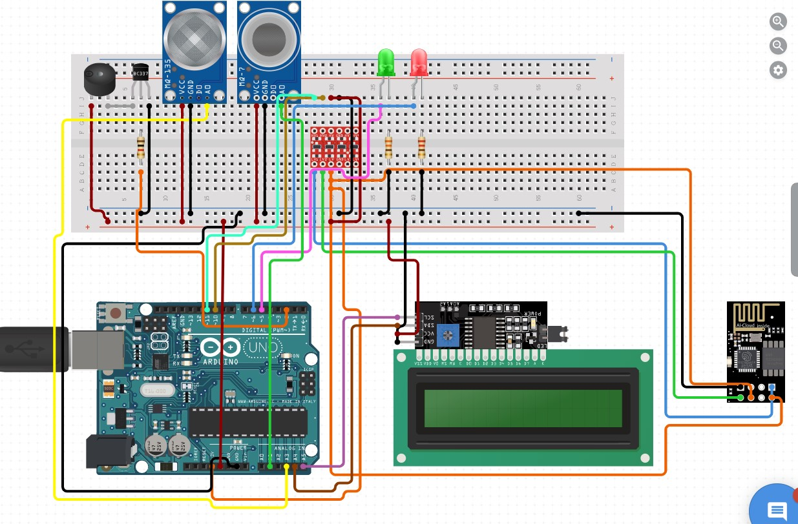

# ENVIRONMENT POLLUTION MONITORING SYSTEM

This project is an Air Pollution Monitoring System using Arduino Mega (ATMega2560) and a NodeMCU-ESP8266 WiFi Module to connect to the internet and send data to the ThingSpeak server. The system monitors air quality using MQ135 and MQ7 sensors and visualizes the data on ThingSpeak. Additionally, it uses LEDs and a buzzer to provide real-time alerts based on the air quality.

## Table of Contents
- [Introduction](#introduction)
- [Features](#features)
- [Components Required](#components-required)
- [Circuit Diagram](#circuit-diagram)
- [Installation](#installation)
- [Usage](#usage)
- [Contributing](#contributing)

## Introduction
The Air Pollution Monitor System measures the concentration of various gases in the air and provides real-time updates. The data is sent to the ThingSpeak server for visualization and analysis. The system also includes a buzzer and LEDs to indicate air quality status immediately.

## Features
- Monitors air quality using MQ135 (CO2) and MQ7 (CO) sensors.
- Sends data to ThingSpeak for visualization.
- Provides real-time alerts using LEDs and a buzzer.
- Displays air quality data on an LCD.

## Components Required
- Arduino Mega (ATMega2560)
- NodeMCU-ESP8266 WiFi Module
- MQ135 Gas Sensor
- MQ7 Gas Sensor
- LCD Display with I2C module
- Buzzer
- LEDs (Green and Red)
- Fan
- Resistors
- Breadboard and Jumper Wires

## Circuit Diagram
 

**ESP-01 Connections:**
- Vcc -> 3.3V
- GND -> GND
- TxD -> Rx1 (Pin 10)
- RxD -> Tx1 (Pin 11)
- CH_PD -> 3.3V

**Sensor Connections:**
- MQ135 -> A0
- MQ7 -> A1

**LED and Buzzer Connections:**
- Green LED -> Pin 8
- Red LED -> Pin 9
- Buzzer -> Pin 5
- Fan -> Pin 6

## Installation
1. Clone the repository:
    ```bash
    git clone https://github.com/yourusername/air-pollution-monitor.git
    ```
2. Open the project in Arduino IDE.
3. Install the required libraries:
    - SoftwareSerial
    - Wire
    - LiquidCrystal_I2C
4. Connect the components as per the circuit diagram.

## Usage
1. Sign up at [ThingSpeak](https://thingspeak.com).
2. Create a new channel and note down the Write API Key.
3. Update the following details in the code:
    - WiFi SSID and Password
    - ThingSpeak Channel ID and Write API Key
4. Upload the code to the Arduino Mega board.
5. Open the Serial Monitor (Set Baud Rate to 9600 and set "Both NL & CR").
6. The system will connect to Wi-Fi and start sending data to ThingSpeak.

## Contributing
Contributions are welcome! Please fork the repository and submit a pull request for any enhancements or bug fixes.
